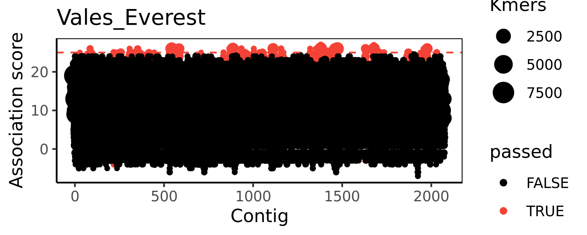
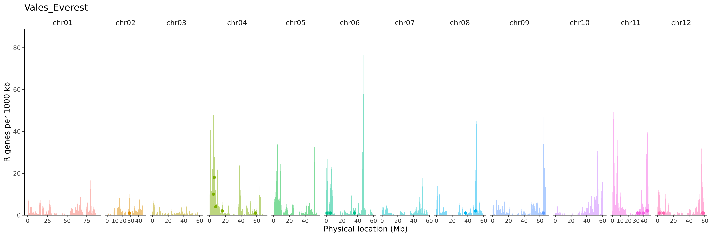
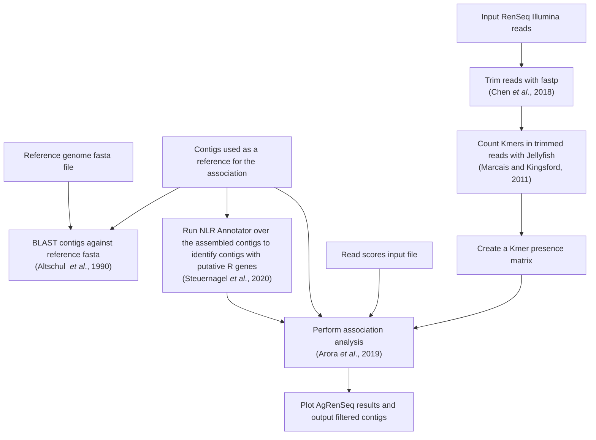

# AgRenSeq Snakemake pipeline

AgRenSeq requires several intermediate steps - this pipeline consolidates this into a single process allowing the user to quickly adjust input files or parameters.
Currently, this workflow uses the java AgRenSeq version, as the python GLM-approach is unusable.

## Usage

All inputs and parameters are handled in the config/ directory.
config.yaml currently takes four options:

* `read_scores` which takes a string of the relative path of the read scores file to the base directory
* `references` which takes a string of the relative path of references file to the base directory
* `blast_genome` which should be the relative path to a reference genome  `.fasta` for BLAST plotting.
* `assoc_threshold` which will set the threshold used to filter contigs by agrenseq association, and plot on the BLAST plot

It's recommended to keep all files in the config directory to keep it tidy.

The `read_scores` file is a tab separated file with four columns, `sample R1 R2 score`.
Each row contains the name, *absolute path* to illumina .fastq.gz R1 and R2, and the phenotype score for each accession passed into the AgRenSeq pipeline.

The `references` file is a tab separated file with two columns, `reference assembly`.
Each row should contain the name of the assembled reference contigs, and the *absolute path* to the assembly fasta.

This pipeline uses fastp to trim and QC reads, it should be safe to pass through reads that have already been trimmed, but double check the `.json` outputs if uncertain.
I find fastp fairly unaggressive and will only result in a minor loss of data.
For the reference genome, I strongly recommend one with only the major chromosomes reported, and not 100+ scaffold sequences, as that will make the plot unreadable.

### Example plots

Certain parameters specific to the crop diversity HPC SLURM system are hardcoded in the snakemake rules, these may need to be adjusted.
Most steps will take under 30 minutes to run, so a short queue is sufficient.

### Results

Results are contained with two directories, `images/` and `results/`.
In results, `{reference}_AgRenSeqResult.txt` is the final output of AgRenSeq, `{reference}_output.nlr.txt` is a list of contigs associated with nlr motifs, and `jellyfish/` cotains the `.dump` files for each accession in `read_scores.txt`.
`images/` will contain a basic plot of the AgRenSeq results, as well as a plot of best blast hits against a reference genome (I recommend DM).

A `logs/` directory will be created and populated with logs of certain processes.

## Graphical summary of workflow

