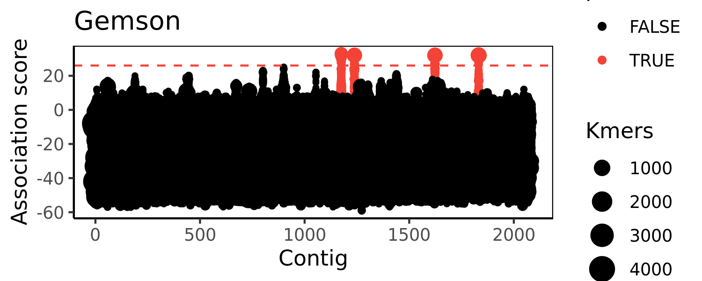
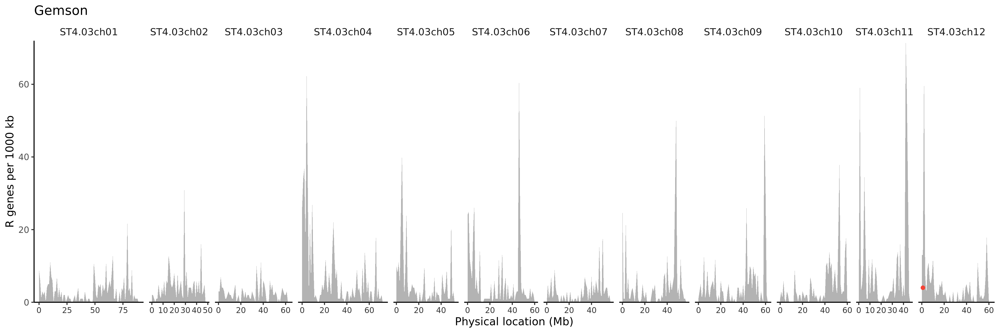
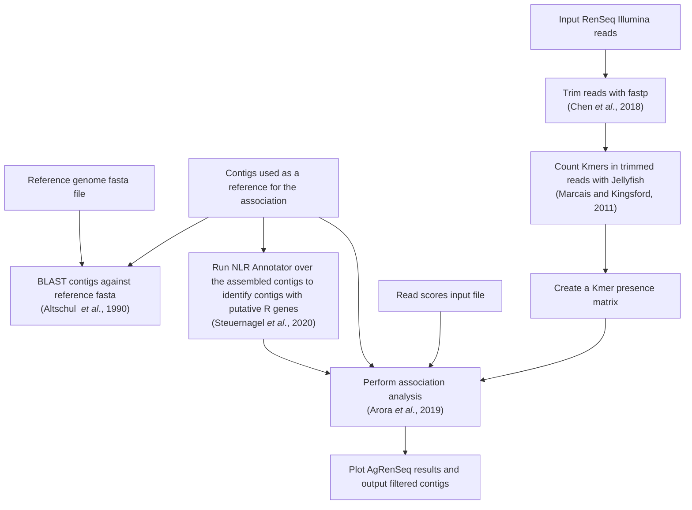

# AgRenSeq Snakemake pipeline

AgRenSeq requires several intermediate steps - this pipeline consolidates this into a single process allowing the user to quickly adjust input files or parameters.
Currently, this workflow uses the java AgRenSeq version.

## Usage

All input files and parameters are handled in by `config/config.yaml`
config.yaml currently takes five options:

* `read_scores` - string of the path to the read scores file
* `references` - string of the path to the references file
* `blast_plot` - boolean value to create optional blast-to-reference plot.
* `blast_genome` string of the path to the reference genome  `.fasta` for optional BLAST plotting.
* `assoc_threshold` integer value of the threshold used to filter contigs by agrenseq association, and plot on the BLAST plot

Paths may be absolute or relative to the directory that `snakemake` is executed from.
It is recommended to execute the workflow from the `agrenseq/` directory.
It's recommended to keep all metadata files in the config directory to keep it tidy.

### Metadata formats

#### read_scores
The `read_scores` file is a tab separated file.
Each row contains the name, path to illumina `.fastq.gz` forward and reverse reads, and the phenotype score for each accession passed into the AgRenSeq pipeline.

Format:

| Sample | R1 | R2 | score |
| --- | --- | --- | --- |
| sample_name_1 | path/read.fq.gz | path/read.fq.gz | 1 |
| sample_name_2 | path/read.fq.gz | path/read.fq.gz | -1 |
| sample_name_3 | path/read.fq.gz | path/read.fq.gz | -0.5 |

#### references

The `references` file is a tab separated file.
Each row should contain the name of the assembled reference contigs, and the path to the assembly `.fasta`.
Assembly names will be used in output plots and files - whitespace or other non-standard chars are not advised.

Format:

| reference | assembly |
| --- | --- |
| reference_1 | path/contigs.fasta |
| reference_2 | path/contigs.fasta |

This pipeline uses fastp to trim and QC reads, it should be safe to pass through reads that have already been trimmed, but double check the `.json` outputs if uncertain.
fastp is fairly unaggressive on trimmed reads and will only result in a minor loss of data.
For the reference genome, it is strongly recommend to use one with only chromosomes, and not 100+ unscaffold sequences, as that will make the final plot unreadable!

## Results

Results are contained with two directories, `images/` and `results/`.
In results, `{reference}_AgRenSeqResult.txt` is the final output of AgRenSeq, `{reference}_output.nlr.txt` is a list of contigs associated with nlr motifs, and `jellyfish/` cotains the `.dump` files for each accession in `read_scores.txt`.
`images/` will contain a basic plot of the AgRenSeq results, as well as a plot of best blast hits against a reference genome (I recommend DM).

A `logs/` directory will be created and populated with logs of certain processes.

### Example plots

*This is the AgRenSeq plot of contig-mapped kmers and their association scores. Kmers with scores > the association threshold are highlighted in red*

*Plot of all assembly contigs mapped to supplied reference genome via BLAST. Highly associated contigs are highlighted as red dots*

Certain parameters specific to the crop diversity HPC SLURM system are hardcoded in the snakemake rules, these may need to be adjusted.
Most steps will take under 30 minutes to run, so a short queue is sufficient.

## Graphical summary of workflow

