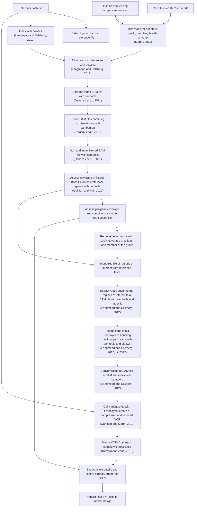

# dRenSeq workflow

## Usage

    *   A reference fasta file of your target genes, ensure this contains regions outside the CDS too, this ensures alignments are performed correctly.  
    *   A BED file of the CDS regions of your targets  
    *   A tab delimited text file with one line per sample and the header line (use absolute file paths): sample FRead RRead  
    *   FASTA files with your adaptor sequences, the current workflow uses two files, though it should be easy to modify this if needed.  

Make modifications to the config.yaml file.
This follows the yaml format of key-value pairs.
Keep the keys as they are, but change the value they are paired with as explained below:

    *   Reference_Fasta - replace the quoted text with a path to your reference fasta file  
    *   CDS_Bed - replace the quoted text with a path to your reference file  
    *   scoreMinRelaxed - This paramter is passed to bowtie2 and controls mismatch rate. The penalty is -6 per mismatch, so for four mismatches in a 100bp read, the penalty is (4 * -6) / 100 = -0.24. So the flag passed to bowtie would be "L,0,-0.24". This value is the default in the example config file.
    *   samples - replace the quoted text with the path to your sample sheet.
    *   adaptor_path_1 - replace the quoted text with the path to one of your adaptor containing fasta files
    *   adaptor_path_2 - replace the quoted text with the path to the other of your adaptor containing fasta files  
    *   gene_groups - replace the quoted text with the path to your gene groups text file.
    *   ploidy - replace the quoted text with the ploidy of your organism eg. for our potato work we set ploidy to 4.
    *   ulimit - If you are using a large number of samples, you may exceed your systems soft limit for the maximum number of open files allowed (often 1,024). The workflow contains a ulimit -n command to change this for the one rule that needs it, simply set the value you want it setting to here. Keep in mind there is also a hard limit on most systems.

Add java utilities to CLASSPATH, either in a profile to automatically add it on every login or manually on the command line before running snakemake if you prefer.

```bash
# In profile
export CLASSPATH=$CLASSPATH:/path/to/utils.jar

# Command line
java -classpath $CLASSPATH:/path/to/utils.jar
```

NEED TO CHANGE ABOVE

When running with additional samples, you may find Snakemake does not compute that changes are required if the access date on your new reads is older than that of your outputs. This can be resolved by using the core GNU utility touch on one of your sets of reads. Snakemake will now assign jobs for all your new samples.

```bash
touch Read_1.fq.gz
touch Read_2.fq.gz
```

Snakemake does have an option to remove all files created by a workflow, similar to make clean from GNU make. **This is a necessary step if you are adding new genes to your analysis.** It can also be useful if you hit an error and are concerned that it may have written an incorrect result file. Most of these will be caught by Snakemake, but this command is included below if needed. If you're running on a cluster, ensure all submitted jobs have finished before running this command.

```bash
snakemake --delete-all-output --cores 1
```

Finally, in some cases you may need to only run one round of analysis and so you may wish to remove the conda environments created by snakemake. This can be done with the following command. If you do rerun in this directory, snakemake will simply recreate the environment.

```bash
rm -rf .snakemake/conda
```

## Graphical summary of workflow


