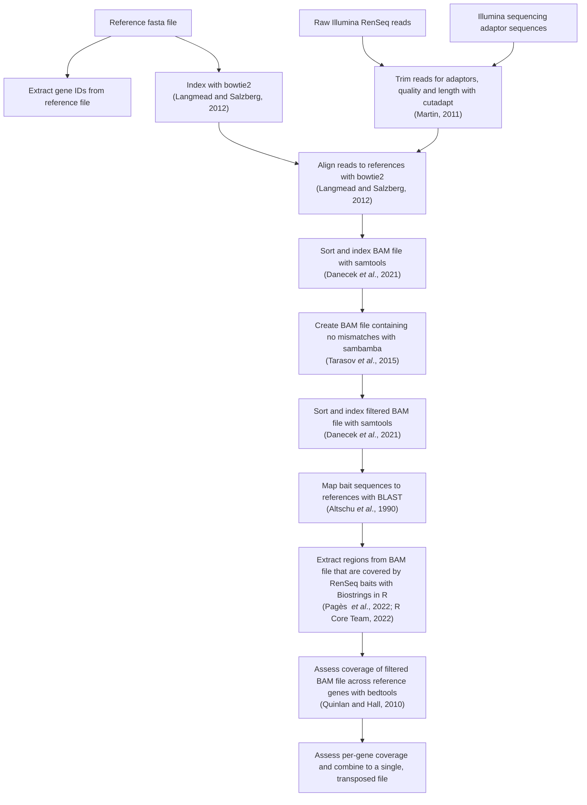

# dRenSeq workflow

## Usage

Make modifications to the `config.yaml` file.
This follows the yaml format of key-value pairs.
`config.yaml` currently takes eight options:

*   `Reference_Fasta` - string of the path to the reference fasta file
*   `CDS_Bed` - string of the path to the CDS file
*   `samples` - string of the path to the samples file
*   `scoreMinRelaxed` - String parameter passed to bowtie2 and controls mismatch rate.
The penalty is -6 per mismatch, so for four mismatches in a 100bp read, the penalty is (4 * -6) / 100 = -0.24.
So the flag passed to bowtie would be "L,0,-0.24".
This value is the default in the example config file.
*   `adaptor_path_1` - string of the path to an adaptor fasta file
*   `adaptor_path_2` - string of the path to the other adaptor fasta file
*   `ulimit` - If you are using a large number of samples, you may exceed your systems soft limit for the maximum number of open files allowed (often 1,024).
The workflow contains a ulimit -n command to change this for the one rule that needs it, simply set the value you want it setting to here.
Keep in mind there is also a hard limit on most systems.
*   `maximum_alignments` - Sets the maximum number of alignments allowed for read mapping with bowtie2.
In development we have used 10 with success.

### Input data

#### reference_fasta

A reference fasta file of your target genes.
Ensure this contains regions outside the CDS too, this ensures alignments are performed correctly.
Make sure the names of the fasta sequences match those in the bed file. Some assemblers add details in a space separated manner. Remove this additional text with the following command:

```bash
sed -i '/^>/ s/ .*//' path_to_fasta
```

#### CDS_Bed

A BED file of the CDS regions of your targets. Consisting of field one of the contig name, the start of the CDS region in column 2, the end of the CDS region in column 3 and the nlr name in column 4. See the example workflow for how to easily parse this from your NLR Annotator bed file.

#### samples

A tab delimited text file with one line per sample and the header line (use absolute file paths)

Format:

| sample | FRead | RRead |
| --- | --- | ---|
| sample_name_1 | path/read.fq.gz | path/read.fq.gz |
| sample_name_2 | path/read.fq.gz | path/read.fq.gz |
| sample_name_3 | path/read.fq.gz | path/read.fq.gz |

#### adaptor_path_1/2

FASTA files with your adaptor sequences.
The current workflow uses two files, though it should be easy to modify this if needed.

### Note

When running with additional samples, you may find Snakemake does not compute that changes are required if the access date on your new reads is older than that of your outputs.
This can be resolved by using the core GNU utility touch on one of your sets of reads.
Snakemake will now assign jobs for all your new samples.

```bash
touch Read_1.fq.gz
touch Read_2.fq.gz
```

## Results

Results are contained in the `coverage/` and `mappings/` directories.
`coverage/` contains intermediate sample coverage files and the final dRenSeq gene-sample coverage matrix `all_coverage_values.txt`.
`mappings/` contains read-mapping files for each sample.

A `logs/` directory will be created and populated with logs of certain processes.

## Graphical summary of workflow


