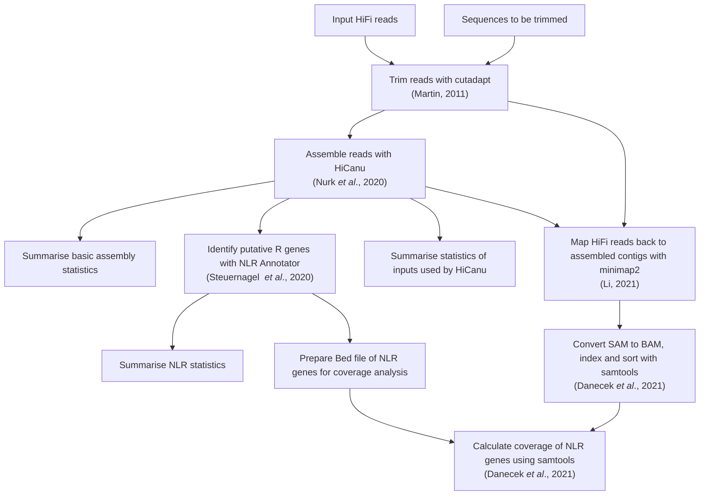

# Assembly of SMRT-RenSeq HiFi data

**NOTE This workflow assumes that the only trimming needed is from the 5' and 3' end. Always check that your trimming results look sensible and keep in mind you may need to remove reverse complements of your adaptors.
This workflow DOES NOT do this and should only be regarded as providing minimal trimming.**

## Usage

This workflow supports parallel assembly of multiple samples.

### Inputs

*   A tab delimited `sample.txt` file with two columns, `sample` and `Reads`.
Each sample is provided on a single line.
`sample` refers to the sample name (no whitespace), `Reads` will contain the absolute file path to the associated `.fastq.gz`.

It is recommended to place the `sample.txt` file under `config/`.

### Configuration

All configuration is handled in the `config/config.yaml` file.
This follows the yaml format of key-value pairs.
Keep the keys as they are, but change the value they are paired with as explained below:

*   samples - replace the quoted text with the path to your sample `.txt` file *relative* to the base directory (e.g., `config/samples.txt`)
*   fiveprime - replace the quoted text with the sequence to be trimmed from the 5' end of the reads
*   threeprime - replace the quoted text with the sequence to be trimmed from the 3' end of the reads
*   Genome_Size - replace the quoted text with the estimated size of the assembly.
Don't worry about being too precise, it seems to only affect the coverage estimate which is less important for HiCanu than in Canu.
*   flanking - replace the quoted text with the number of flanking bases to be used for extracting the fastas of NLR Annotator hits.
At least 1,000 is recommended.

## Results

TODO

## Graphical summary of workflow

