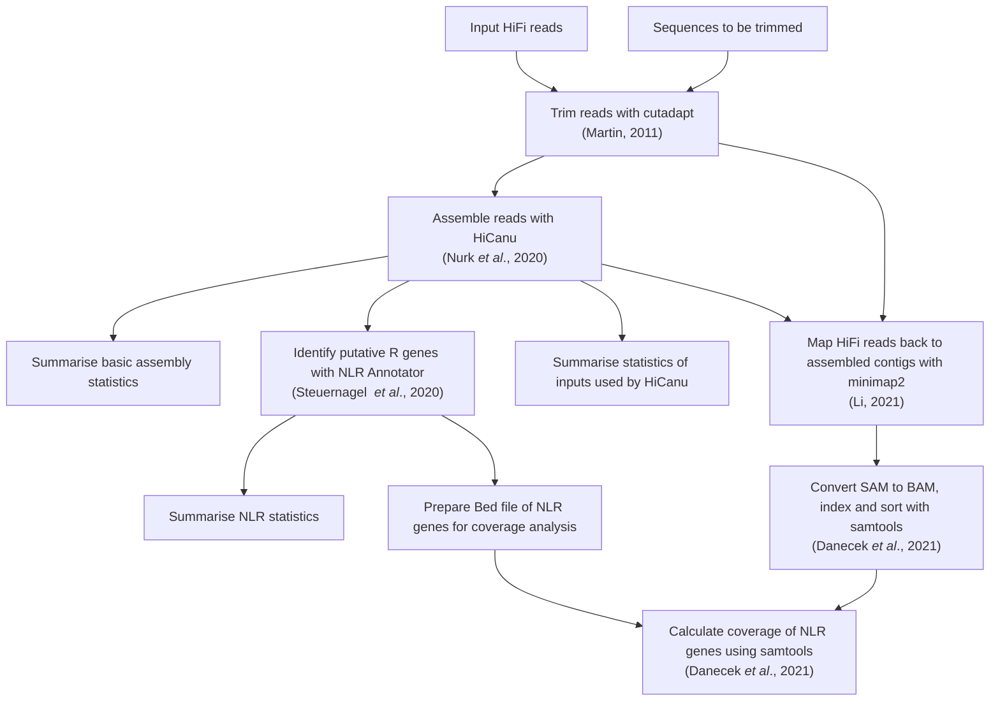

# SMRT-RenSeq workflow

**NOTE This workflow assumes that the only trimming needed is from the 5' and 3' end. Always check that your trimming results look sensible and keep in mind you may need to remove reverse complements of your adaptors.
This workflow DOES NOT do this and should only be regarded as providing minimal trimming.**

## Usage

This workflow supports parallel assembly of multiple samples.
All input files and parameters are handled by the config file `config/config.yaml`.
`config.yaml` currently takes five options:

*   `samples` - string of the path to the samples file.
*   `fiveprime` - string of the sequence to be trimmed from the 5' end of the reads.
*   `threeprime` - string of the sequence to be trimmed from the 3' end of the reads.
*   `Genome_Size` - string of the the estimated size of the assembly.
Don't worry about being too precise, it seems to only affect the coverage estimate which is less important for HiCanu than in Canu.
*   `flanking` - string of the number of flanking bases to be used for extracting the fastas of NLR Annotator hits.
At least 1,000 is recommended.

Paths may be relative to the base `smrtrenseq_assembly` directory, or be absolute.

### Input data

#### samples

The `samples` file is a tab separated file.
Each row contains the sample name and the path to the raw reads.

Format:

| sample | Reads |
| --- | --- |
| samples_name_1 | path/read.fq.gz |
| samples_name_2 | path/read.fq.gz |
| samples_name_3 | path/read.fq.gz |

It is recommended to place the `sample.txt` file under `config/`.

## Results

Results are contained within directories `assembly/`, `mapping/`, `NLR_Annotator/`, and `NLR_coverage/`.
`assembly/` contains the assembled contigs of each sample as well as summary statistics.
`mapping/` contains read-mapping data for each sample.
`NLR_Annotator/` contains the extracted NLRs for each sample.
`NLR_coverage/` contains coverage data for each sample.

## Graphical summary of workflow

